

  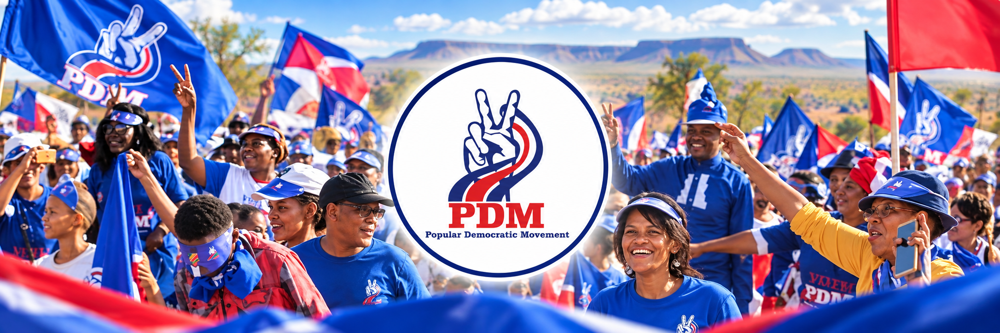

  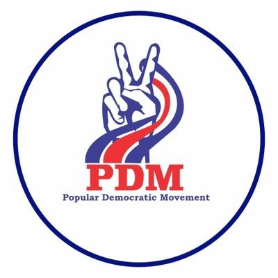

# PDM Namibia — Move Namibia Forward

**[Visit the live experience](https://pdm-namibia.pages.dev/)**

The Popular Democratic Movement is a Namibian political party with roots stretching back to 1977 and a national programme centred on democratic accountability, opportunity and service. This project turns that history, leadership and public work into an owned digital experience designed to inform citizens, welcome members and make the movement feel unmistakably alive.

## The brief

Gabriella Stadhauer asked for one coherent home spanning ten core areas: Home, About PDM, Leadership Structure, News & Media, Our Policies, Parliamentary Work, Party Structures, Join PDM, Events and Contact. The finished prototype had to do more than place those headings on static colour bands. It needed to give PDM a confident digital identity, elevate the Top 9, feel exceptional on a phone and install like an app.

## What shipped

- A cinematic, image-led home with an intentional PDM blue, red and white visual system
- History, vision, mission and values built into one readable movement story
- A complete Top 9 leadership presentation using source-grounded portraits and roles
- News, press statements, speeches, *The Alternative* and social channels
- Manifesto, policy priorities and downloadable public documents
- Parliamentary work, MPs, questions, motions and activity pathways
- Women’s League, Youth League and regional/constituency structure entry points
- Events, membership and contact journeys with clear prototype boundaries
- An installable Progressive Web App with custom icons and offline support
- A compact mobile navigation, thumb-friendly actions, responsive type and careful image crops
- A branded opening sequence, scroll progress, staggered reveals, tactile cards and reduced-motion support

## From sections to a living political identity

The first design challenge was avoiding a “dead wall paint” result: stacked bands of colour with no pace, narrative or consequence. The final system gives every section a job. Documentary photography supplies human scale. Diagonal ribbons, editorial typography and oversized movement language carry PDM’s energy between sections. Cards change form based on their content instead of repeating one template.

The colours are intentionally political and unmistakably PDM, but the interface does not rely on colour alone. Contrast, hierarchy, iconography, spacing and interaction states keep information readable and accessible.

<table>
  <tr>
    <td width="50%">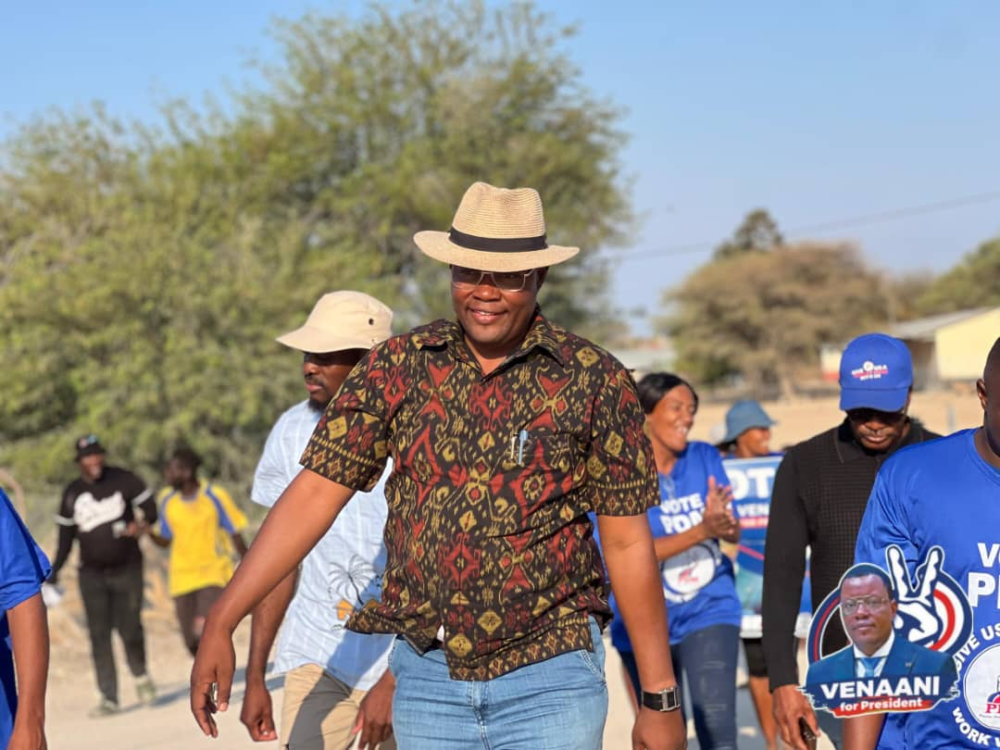</td>
    <td width="50%">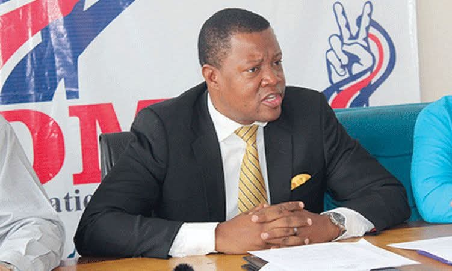</td>
  </tr>
</table>

## Leadership as evidence

Leadership is treated as a primary public-information surface, not a row of names hidden under About. Each Top 9 member has a distinct portrait card, role label and numbered place in the national structure. The presentation is grounded in PDM’s own February 2026 edition of *The Alternative*.

<table>
  <tr>
    <td width="33%">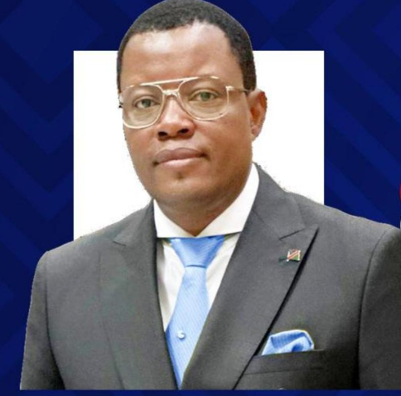</td>
    <td width="33%">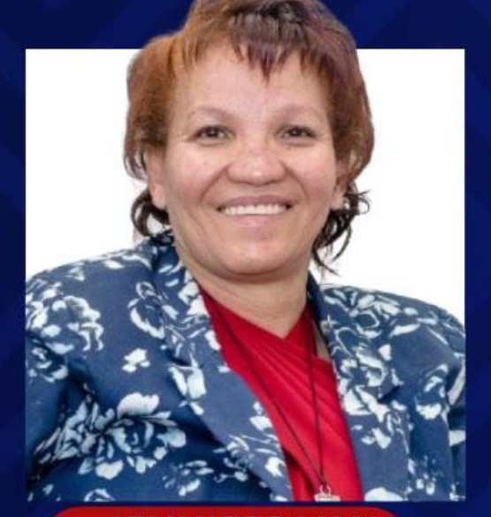</td>
    <td width="33%">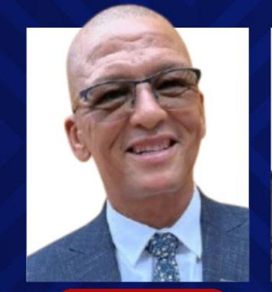</td>
  </tr>
  <tr>
    <td width="33%">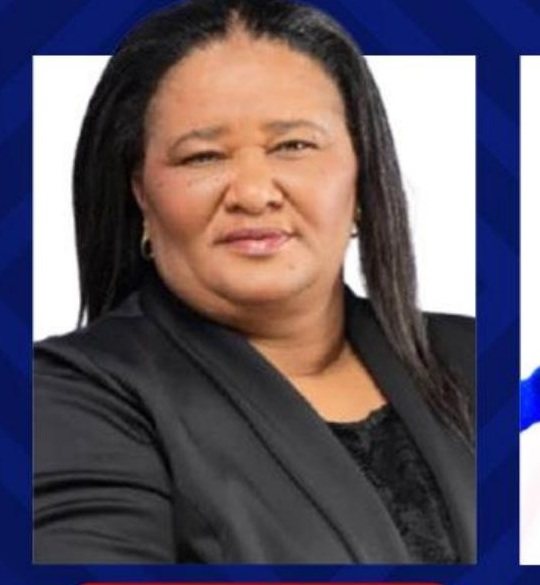</td>
    <td width="33%">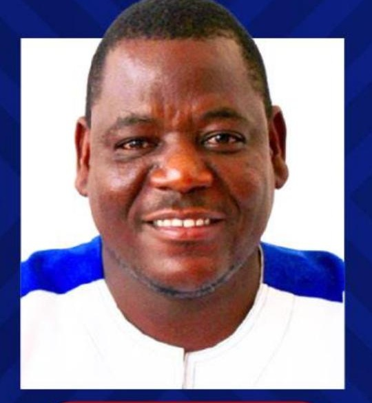</td>
    <td width="33%">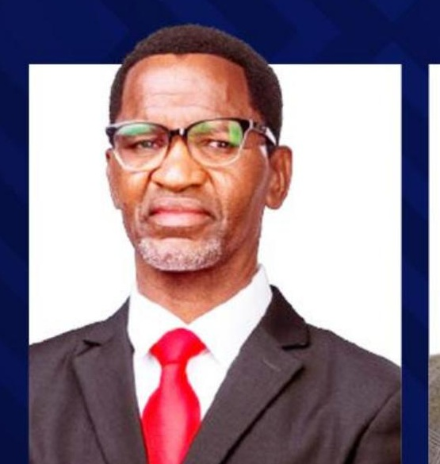</td>
  </tr>
  <tr>
    <td width="33%">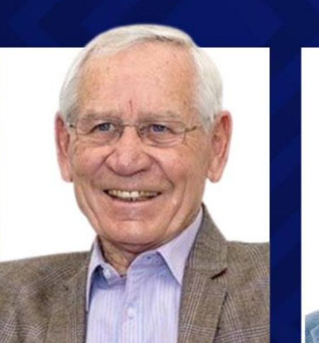</td>
    <td width="33%">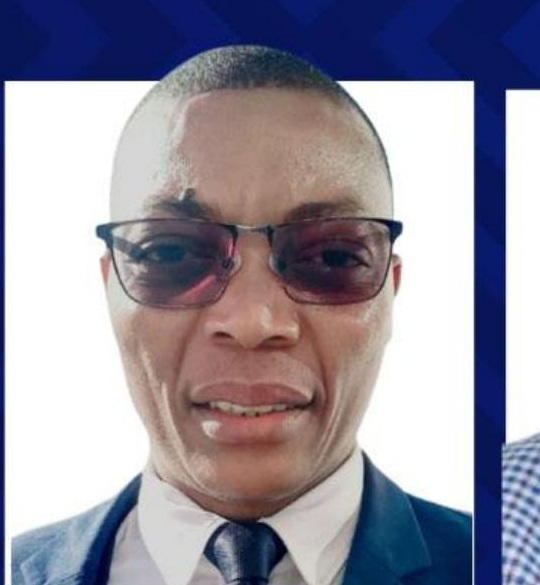</td>
    <td width="33%"></td>
  </tr>
</table>

## Motion with discipline

Motion makes the experience feel responsive without becoming political theatre. A brief logo-led opening sequence introduces the identity. Scroll-linked progress, staged card reveals, animated tickers, live button feedback and touch-scale transitions reward exploration. Every major animation respects `prefers-reduced-motion`, and the content remains complete without motion.

## Mobile hardening and installation

The mobile version is a deliberate product surface. The menu becomes a full-screen numbered navigator; calls to join, install and share stay clear; cards recompose instead of simply shrinking; and visual density is tuned for small screens. A web app manifest, service worker and maskable icons let supporters install the experience from supported browsers.

## Research and editorial boundary

Public PDM channels, electoral records, parliamentary references, party publications and reputable Namibian reporting informed the prototype. Source links remain visible in the product so public claims can be checked. The membership and contact submissions remain clearly marked prototype interactions until PDM selects and approves the secure operational workflow.

## Product boundary

This repository is a public case study. Production source, original working files, form infrastructure and deployment configuration remain in a separate private repository. PDM brand marks and photographic assets shown here belong to their respective owners and are presented with permission for this project; they are not licensed for reuse.

## Role

Political and organisational research · information architecture · identity translation · art direction · UX/UI · responsive frontend engineering · interaction and motion design · PWA engineering · accessibility · mobile hardening · Cloudflare deployment

## Links

- [PDM Namibia — live experience](https://pdm-namibia.pages.dev/)
- [Freeman Ipumbu portfolio](https://freeman-ipumbu.pages.dev/)
- [PDM Namibia on X](https://x.com/OfficialPDM_Na)
- [PDM Namibia on Facebook](https://www.facebook.com/OfficialOppositionNamibia/)
- [PDM 2024 manifesto](https://nbcnews.na/sites/default/files/elections/10/PDM%20Manifesto.pdf)

---

A Digital Experience by **[SolarSpin Technologies](https://freeman-ipumbu.pages.dev/)**. Built by Freeman Ipumbu for PDM and for every Namibian who deserves public information with clarity, confidence and life.
